# スクリーンキャプチャ集

動画で使った実物のキャプチャです。すべて実際に動かした画面 (1440x900・実ブラウザ)。

- `initial.png` — 共通デモの初期表示。**全実装でピクセル単位に同じ**になるのが仕様です
- `ops.png` — 共通の操作後 (検索「vue」+ TypeScript 絞り込み + お気に入り1件)。これも全実装で同じ
- その他 — 各回の特徴デモ。`demo.gif` はアニメーションの録画 (元動画は同じフォルダの `demo.mp4`)

initial / ops が全フォルダで同じに見えるのは手抜きではなく、**条件を揃えた証明**です
(共通CSS・共通データ。違いはコードと転送量に出る)。

## 第1回 Vite

| 初期表示 | 操作後 |
|---|---|
| 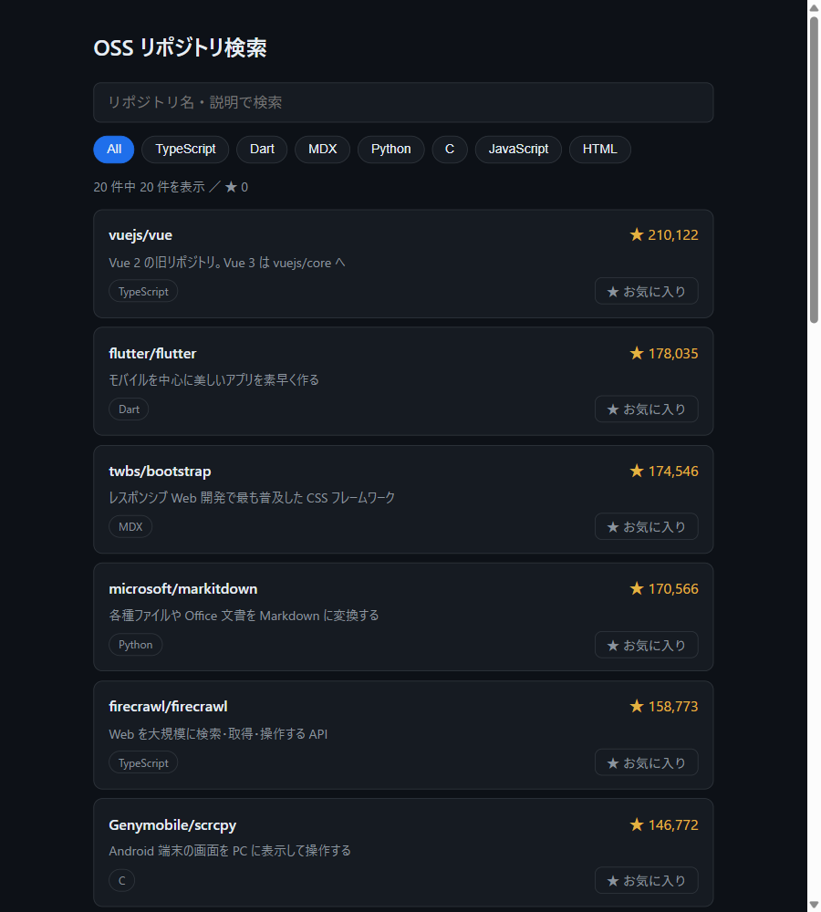 | 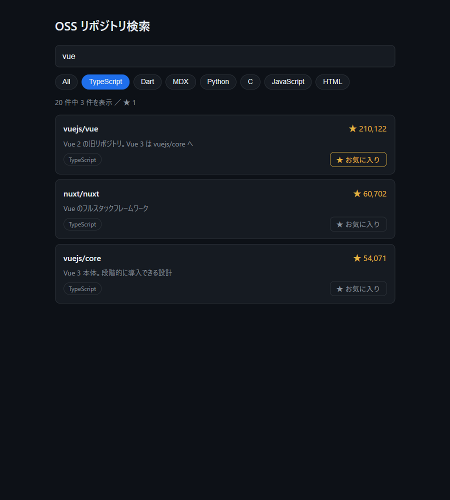 |

特徴デモ: HMR (編集前後)

| 編集前 | 編集後 (リロードなしで反映) |
|---|---|
| 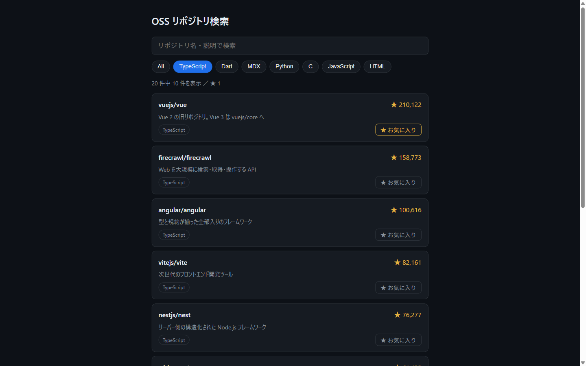 | 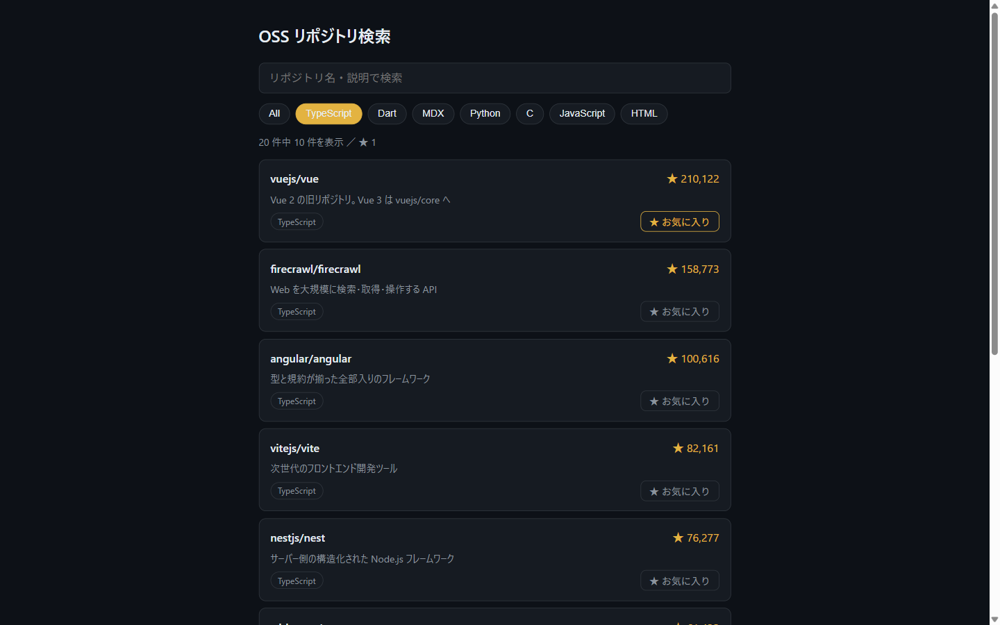 |

## 第2回 Vue 3

| 初期表示 | 操作後 |
|---|---|
|  |  |

特徴デモ: `<TransitionGroup>` によるリストアニメーション ([mp4](./vue/demo.mp4))

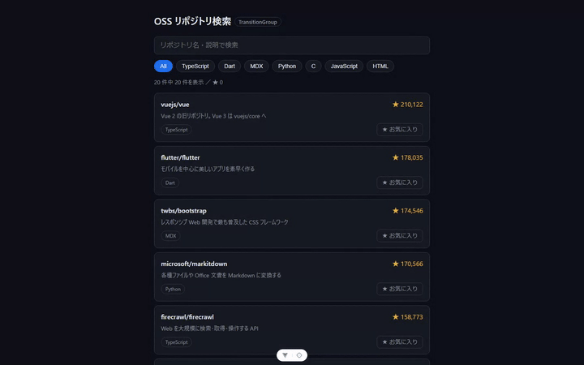

## 第3回 Angular

| 初期表示 | 操作後 |
|---|---|
|  |  |

特徴デモ: リアクティブフォーム

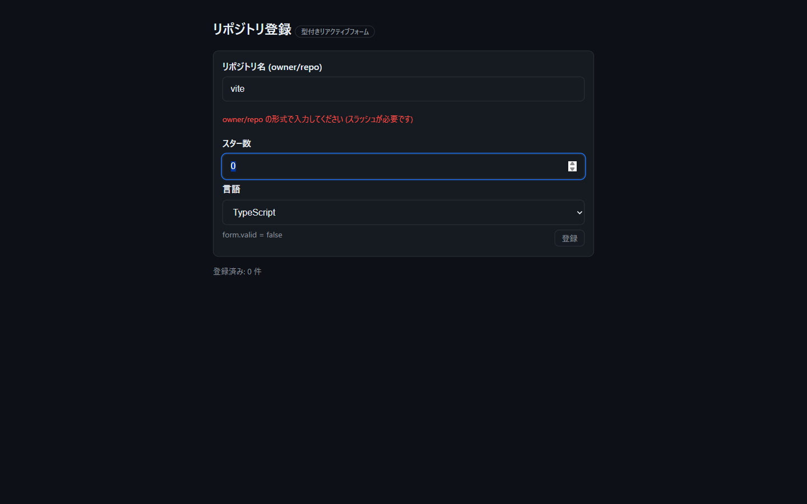

## 第4回 Svelte

| 初期表示 | 操作後 |
|---|---|
|  |  |

特徴デモ: 組み込みトランジション ([mp4](./svelte/demo.mp4))

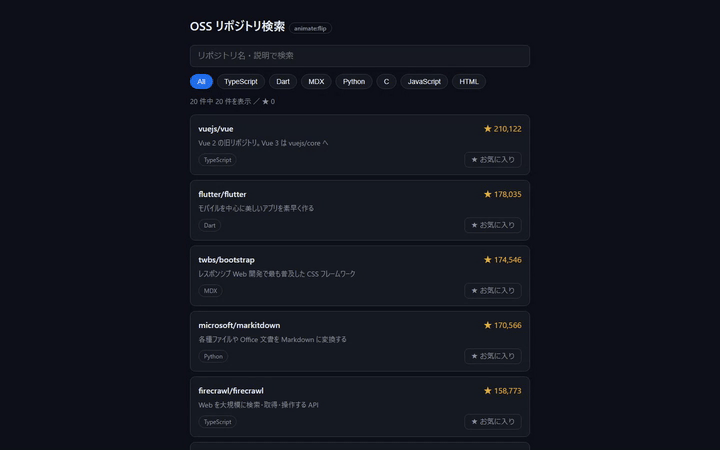

## 第5回 Next.js

| 初期表示 | 操作後 |
|---|---|
| 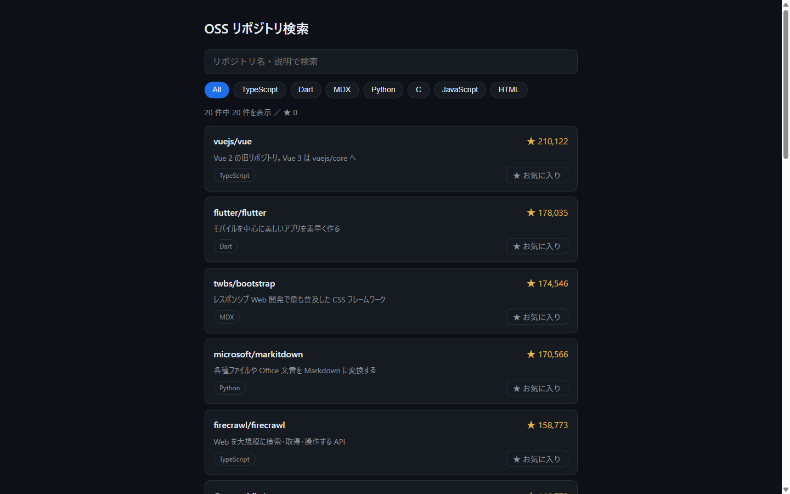 |  |

特徴デモ: サーバコンポーネント (JavaScript を切っても本文が表示される)

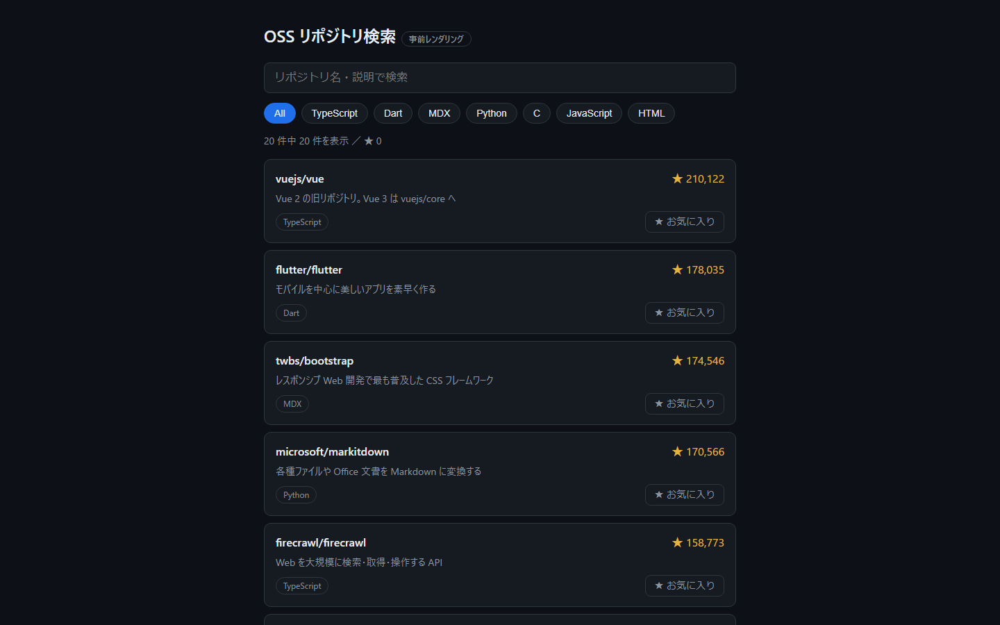

## 第6回 Nuxt

| 初期表示 | 操作後 |
|---|---|
|  |  |

特徴デモ: `server/api` によるサーバルート

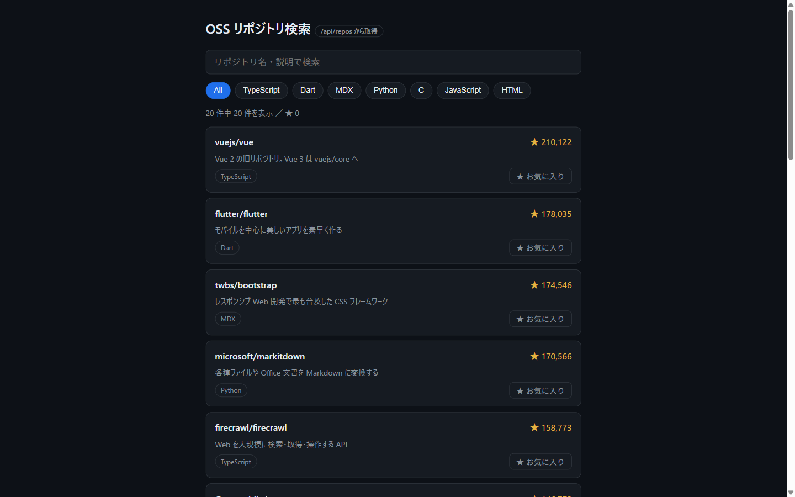

## 第7回 SvelteKit

| 初期表示 | 操作後 |
|---|---|
|  |  |

特徴デモ: フォームアクション (JavaScript を切っても動く)

| JS off・送信前 | JS off・送信後 |
|---|---|
|  |  |

## 第8回 Astro

| 初期表示 | 操作後 |
|---|---|
|  |  |

特徴デモ: コンテンツコレクション (Markdown 記事一覧・JS ゼロ)

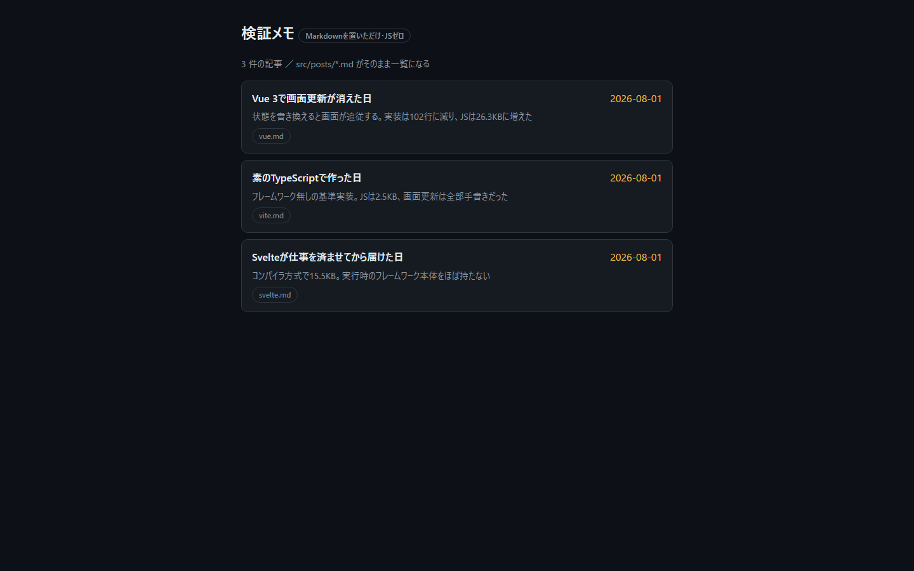

## 第9回 htmx

| 初期表示 | 操作後 |
|---|---|
|  |  |

特徴デモ: サーバが返す HTML 断片そのもの

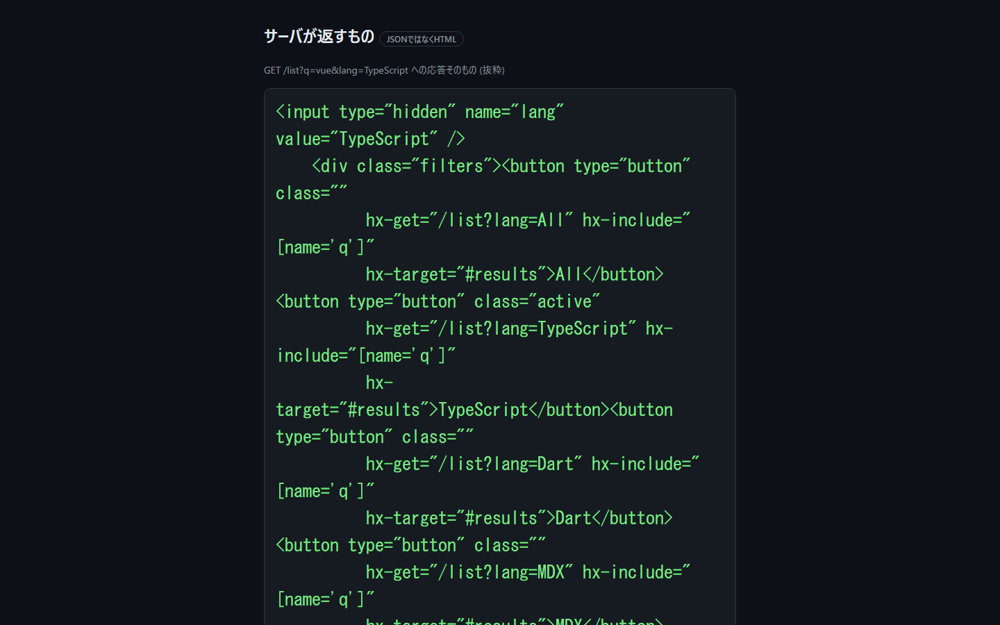

## 第10回 Alpine.js

| 初期表示 | 操作後 |
|---|---|
|  |  |

特徴デモ: HTML 属性だけで書いた FAQ アコーディオン

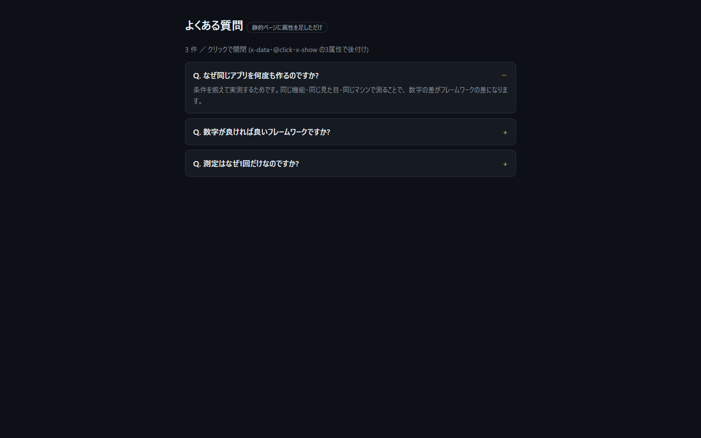

## 第11回 SolidJS

| 初期表示 | 操作後 |
|---|---|
|  | 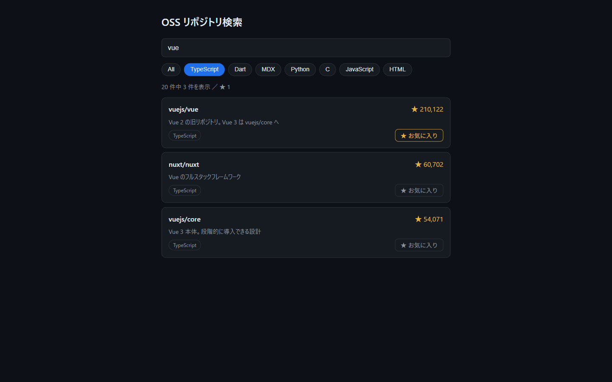 |

特徴デモ: 400セルの時計グリッド (コンポーネント再実行なしで毎秒更新 / [mp4](./solid/demo.mp4))

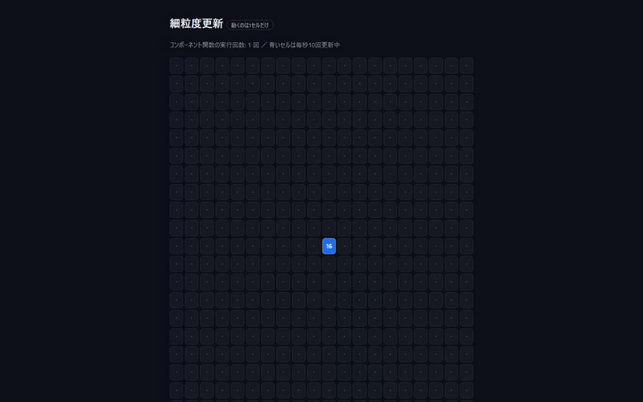

## 第12回 Qwik

| 初期表示 | 操作後 |
|---|---|
|  |  |

特徴デモ: 3つのタイミング (表示の瞬間 / 暇な時間 / クリックの瞬間) で届いた JS の実測

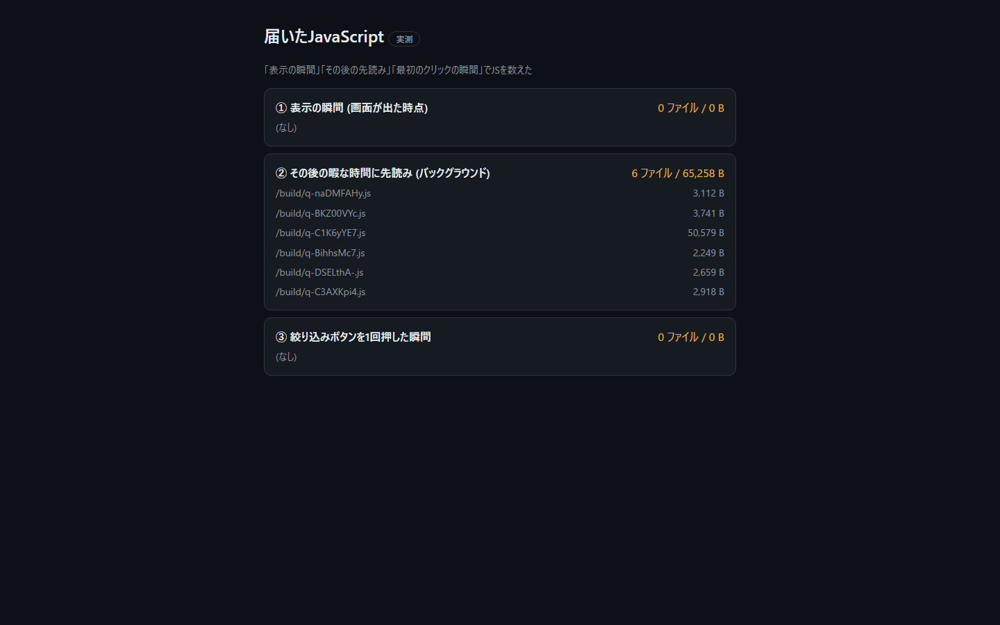

## 第13回 Preact

| 初期表示 | 操作後 |
|---|---|
|  |  |

特徴デモ: React 互換 — react 未インストールのまま `import ... from 'react'` のコードが動作

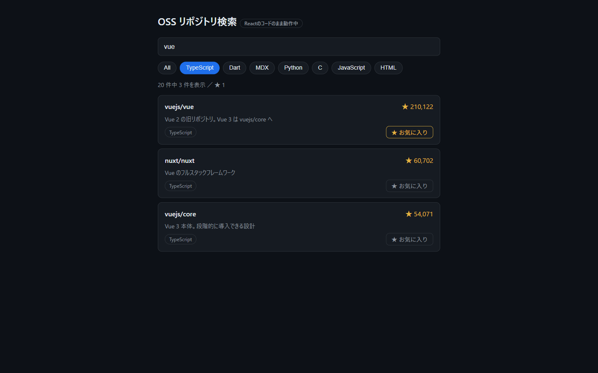
